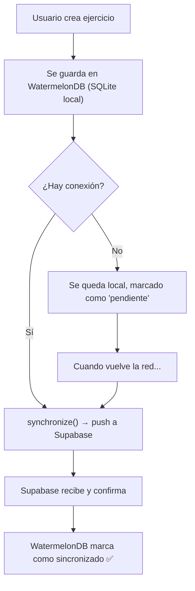

# 🌊 Guía WatermelonDB + Supabase Sync — GymTrack

## Índice
1. [¿Qué es WatermelonDB?](#conceptos)
2. [Arquitectura Offline-First](#arquitectura)
3. [Instalación paso a paso](#instalacion)
4. [Schema & Models](#schema)
5. [Inicialización de la Database](#database)
6. [CRUD — Operaciones locales](#crud)
7. [Queries reactivas en React](#queries)
8. [Sync con Supabase (función reutilizable)](#sync)
9. [Backend: SQL Functions en Supabase](#backend)
10. [Auto-sync con detección de red](#network)
11. [Plan de implementación](#plan)

---

## 1. ¿Qué es WatermelonDB? {#conceptos}

WatermelonDB es una base de datos **reactiva** para React Native que usa **SQLite** por debajo. Los conceptos clave son:

| Concepto | ¿Qué es? | Equivalente en Supabase |
|----------|-----------|------------------------|
| **Schema** | Define las tablas y columnas (como un `CREATE TABLE`) | La definición de tabla en el Dashboard |
| **Model** | Clase JS que representa una fila. Tiene decoradores (`@field`, `@text`) | Una fila de la tabla |
| **Database** | La instancia SQLite que conecta todo | Tu proyecto Supabase |
| **Adapter** | El "driver" que habla con SQLite nativo | El cliente `supabase-js` |
| **`synchronize()`** | Función que orquesta pull + push | No tiene equivalente directo |

### Flujo de datos Offline-First

```
┌─────────────────────────────────────────────┐
│                  TU APP                      │
│                                              │
│  ┌──────────┐    observe()    ┌───────────┐  │
│  │   React  │◄──────────────►│ WatermelonDB│ │
│  │Component │  (reactivo)    │  (SQLite)   │ │
│  └──────────┘                └──────┬──────┘ │
│                                     │        │
│                              synchronize()   │
│                                     │        │
└─────────────────────────────────────┼────────┘
                                      │
                               ┌──────▼──────┐
                               │   Supabase  │
                               │  (Postgres) │
                               └─────────────┘
```

> [!IMPORTANT]
> La app **SIEMPRE** lee y escribe en WatermelonDB local. Supabase **solo** se usa para sincronizar. El usuario nunca espera a la red para ver/crear datos.

---

## 2. Arquitectura Offline-First {#arquitectura}



---

## 3. Instalación paso a paso {#instalacion}

> [!CAUTION]
> WatermelonDB **NO funciona con Expo Go**. Necesitás un **development build** (`npx expo run:android` o `npx expo run:ios`).

### Paso 1: Instalar dependencias

```bash
# WatermelonDB
npx expo install @nozbe/watermelondb

# Plugin de Expo para configuración nativa automática
npx expo install @morrowdigital/watermelondb-expo-plugin

# Plugin de Babel para decoradores (requerido por los Models)
npm install -D @babel/plugin-proposal-decorators

# Para detectar conexión a internet  
npx expo install @react-native-community/netinfo
```

### Paso 2: Configurar `babel.config.js`

El plugin de decoradores **DEBE** ir **ANTES** de `react-native-reanimated/plugin`.

```diff
 module.exports = function (api) {
   api.cache(true);
   return {
     presets: [
       ["babel-preset-expo", { jsxImportSource: "nativewind" }],
       "nativewind/babel",
     ],
-    plugins: ["react-native-reanimated/plugin"],
+    plugins: [
+      ["@babel/plugin-proposal-decorators", { legacy: true }],
+      "react-native-reanimated/plugin",  // ← SIEMPRE al final
+    ],
   };
 };
```

### Paso 3: Configurar `app.json`

```diff
 "plugins": [
   "expo-font",
-  "expo-video"
+  "expo-video",
+  "@morrowdigital/watermelondb-expo-plugin"
 ]
```

### Paso 4: Prebuild y dev client

```bash
# Limpiar y regenerar carpetas nativas
npx expo prebuild --clean

# Correr en Android (o iOS)
npx expo run:android
```

---

## 4. Schema & Models {#schema}

### Estructura de archivos sugerida

```
src/
  database/
    supabase.js              ← (ya existe)
    index.js                 ← Inicialización de WatermelonDB
    schema.js                ← Definición de tablas
    migrations.js            ← Migraciones futuras
    models/
      Exercise.js            ← Model de ejercicios
      Profile.js             ← Model de perfiles (futuro)
    sync.js                  ← Función de sync reutilizable
```

### `src/database/schema.js` — Definir tus tablas

```js
import { appSchema, tableSchema } from "@nozbe/watermelondb";

export const schema = appSchema({
  version: 1, // Incrementar con cada cambio de schema
  tables: [
    // ─── Tabla: exercises_base ───
    tableSchema({
      name: "exercises_base",
      columns: [
        { name: "name", type: "string" },
        { name: "category", type: "string" },
        { name: "muscle_group", type: "string", isOptional: true },
        { name: "equipment", type: "string", isOptional: true },
        { name: "video_public_id", type: "string", isOptional: true },
        { name: "youtube_video_url", type: "string", isOptional: true },
        { name: "image_public_id", type: "string", isOptional: true },
        { name: "instructions", type: "string", isOptional: true },
        { name: "is_unilateral", type: "boolean" },
        // Timestamps para sync
        { name: "created_at", type: "number" },
        { name: "updated_at", type: "number" },
      ],
    }),

    // ─── Ejemplo: otra tabla que podrías agregar después ───
    // tableSchema({
    //   name: "profiles",
    //   columns: [
    //     { name: "user_id", type: "string" },
    //     { name: "full_name", type: "string" },
    //     { name: "avatar_url", type: "string", isOptional: true },
    //     { name: "created_at", type: "number" },
    //     { name: "updated_at", type: "number" },
    //   ],
    // }),
  ],
});
```

> [!NOTE]
> **Tipos disponibles en WatermelonDB:**
> - `"string"` → texto
> - `"number"` → números y timestamps (guardados como epoch ms)
> - `"boolean"` → true/false
>
> No existe `"date"`. Las fechas se guardan como `number` y se usan con el decorador `@date`.

### `src/database/models/Exercise.js` — El Model

```js
import { Model } from "@nozbe/watermelondb";
import { field, text, readonly, date } from "@nozbe/watermelondb/decorators";

export default class Exercise extends Model {
  // 👇 Nombre de la tabla en el schema (DEBE coincidir)
  static table = "exercises_base";

  // Campos de texto (trim automático de whitespace)
  @text("name") name;
  @text("category") category;
  @text("muscle_group") muscleGroup;
  @text("equipment") equipment;
  @text("video_public_id") videoPublicId;
  @text("youtube_video_url") youtubeVideoUrl;
  @text("image_public_id") imagePublicId;
  @text("instructions") instructions;

  // Campo booleano
  @field("is_unilateral") isUnilateral;

  // Timestamps (readonly = no se pueden modificar manualmente)
  @readonly @date("created_at") createdAt;
  @readonly @date("updated_at") updatedAt;
}
```

> [!TIP]
> **Decoradores explicados:**
> - `@text("column")` → para strings, aplica `.trim()` automáticamente
> - `@field("column")` → para number/boolean, sin transformaciones
> - `@date("column")` → convierte epoch (number) ↔ `Date` automáticamente
> - `@readonly` → previene escritura directa (ideal para timestamps)

### `src/database/migrations.js` — Migraciones (empezar vacío)

```js
import {
  schemaMigrations,
  // createTable,
  // addColumns,
} from "@nozbe/watermelondb/Schema/migrations";

export const migrations = schemaMigrations({
  migrations: [
    // Cuando cambies el schema, agregá migraciones acá.
    // Ejemplo futuro:
    // {
    //   toVersion: 2,
    //   steps: [
    //     addColumns({
    //       table: "exercises_base",
    //       columns: [{ name: "difficulty", type: "string" }],
    //     }),
    //   ],
    // },
  ],
});
```

---

## 5. Inicialización de la Database {#database}

### `src/database/index.js`

```js
import { Database } from "@nozbe/watermelondb";
import SQLiteAdapter from "@nozbe/watermelondb/adapters/sqlite";

import { schema } from "./schema";
import { migrations } from "./migrations";

// Models — importar todos acá
import Exercise from "./models/Exercise";

// Crear el adapter SQLite
const adapter = new SQLiteAdapter({
  schema,
  migrations,
  // Usar JSI para máximo rendimiento (requiere Hermes, que ya tenés)
  jsi: true,
  // Activar onSetUpError para atrapar errores de inicialización
  onSetUpError: (error) => {
    console.error("❌ Error inicializando WatermelonDB:", error);
  },
});

// Crear la instancia de Database
export const database = new Database({
  adapter,
  modelClasses: [
    Exercise,
    // Agregar más models acá cuando los crees
  ],
});
```

### Proveer la Database en `_layout.jsx`

```diff
+ import { DatabaseProvider } from "@nozbe/watermelondb/react";
+ import { database } from "../src/database";

  // Dentro del return de RootLayout:
  <GestureHandlerRootView style={{ flex: 1 }}>
    <SafeAreaProvider>
      <QueryClientProvider client={queryClient}>
+       <DatabaseProvider database={database}>
          <ThemeProvider value={colorScheme === "dark" ? DarkTheme : DefaultTheme}>
            {/* ... resto del layout ... */}
          </ThemeProvider>
+       </DatabaseProvider>
      </QueryClientProvider>
    </SafeAreaProvider>
  </GestureHandlerRootView>
```

---

## 6. CRUD — Operaciones locales {#crud}

Todas las operaciones se hacen sobre WatermelonDB local. **Nunca tocan Supabase directamente.**

### CREATE — Crear un ejercicio

```js
import { database } from "../database";

async function createExercise(formValues) {
  await database.write(async () => {
    await database.get("exercises_base").create((exercise) => {
      exercise.name = formValues.name;
      exercise.category = formValues.category;
      exercise.muscleGroup = formValues.muscle_group;
      exercise.equipment = formValues.equipment;
      exercise.videoPublicId = formValues.video_public_id;
      exercise.youtubeVideoUrl = formValues.youtube_video_url;
      exercise.imagePublicId = formValues.image_public_id;
      exercise.instructions = formValues.instructions;
      exercise.isUnilateral = formValues.is_unilateral;
    });
  });
}
```

### READ — Leer ejercicios

```js
// Obtener todos
const exercises = await database.get("exercises_base").query().fetch();

// Filtrar por categoría
import { Q } from "@nozbe/watermelondb";
const fuerzaExercises = await database
  .get("exercises_base")
  .query(Q.where("category", "fuerza"))
  .fetch();

// Buscar por ID
const exercise = await database.get("exercises_base").find("some-id");
```

### UPDATE — Actualizar un ejercicio

```js
async function updateExercise(exercise, newValues) {
  await database.write(async () => {
    await exercise.update((ex) => {
      ex.name = newValues.name;
      ex.category = newValues.category;
      // ... etc
    });
  });
}
```

### DELETE — Eliminar un ejercicio

```js
async function deleteExercise(exercise) {
  await database.write(async () => {
    await exercise.markAsDeleted(); // ← Marca para sync, NO borra físicamente
  });
}
```

> [!WARNING]
> **`markAsDeleted()` vs `destroyPermanently()`:**
> - `markAsDeleted()` → marca el registro como eliminado pero lo mantiene en SQLite para que el sync pueda propagarlo al servidor. **Usar siempre este.**
> - `destroyPermanently()` → borra de verdad. Si usás sync, **nunca uses esto** directamente.

---

## 7. Queries reactivas en React {#queries}

WatermelonDB tiene hooks para que tu UI se actualice automáticamente cuando los datos cambian.

### Hook `useQuery` — en componentes

```jsx
import { useDatabase } from "@nozbe/watermelondb/react";
import { Q } from "@nozbe/watermelondb";

function ExerciseList() {
  const database = useDatabase();

  // Obtener la collection
  const exercisesCollection = database.get("exercises_base");

  // Query reactiva — se actualiza sola cuando hay cambios
  const exercises = exercisesCollection
    .query(Q.sortBy("created_at", Q.desc))
    .observe(); // ← Retorna un Observable (RxJS)

  // ...
}
```

### Forma más simple con `withObservables` (HOC)

```jsx
import { withObservables } from "@nozbe/watermelondb/react";
import { Q } from "@nozbe/watermelondb";
import { database } from "../../database";

// 1. Componente puro
function ExerciseList({ exercises }) {
  return exercises.map((ex) => (
    <Text key={ex.id}>{ex.name}</Text>
  ));
}

// 2. Conectar con WatermelonDB
const enhance = withObservables([], () => ({
  exercises: database
    .get("exercises_base")
    .query(Q.sortBy("created_at", Q.desc))
    .observe(),
}));

export default enhance(ExerciseList);
```

### Forma más moderna con `useObservable` custom hook

```jsx
import { useState, useEffect } from "react";
import { Q } from "@nozbe/watermelondb";
import { database } from "../database";

// Hook reutilizable
export function useWatermelonQuery(tableName, queryConditions = []) {
  const [data, setData] = useState([]);
  const [loading, setLoading] = useState(true);

  useEffect(() => {
    const subscription = database
      .get(tableName)
      .query(...queryConditions)
      .observe()
      .subscribe((records) => {
        setData(records);
        setLoading(false);
      });

    return () => subscription.unsubscribe();
  }, [tableName]);

  return { data, loading };
}

// Uso:
function ExerciseList() {
  const { data: exercises, loading } = useWatermelonQuery("exercises_base", [
    Q.sortBy("created_at", Q.desc),
  ]);

  if (loading) return <Text>Cargando...</Text>;
  return exercises.map((ex) => <Text key={ex.id}>{ex.name}</Text>);
}
```

---

## 8. Sync con Supabase — Función reutilizable {#sync}

> [!IMPORTANT]
> Esta es la parte que pediste: una función donde le pasás las tablas y ella se encarga de sincronizar.

### `src/database/sync.js`

```js
import { synchronize } from "@nozbe/watermelondb/sync";
import { database } from "./index";
import { supabase } from "./supabase";

/**
 * Sincroniza WatermelonDB con Supabase.
 *
 * @param {Object} options
 * @param {string[]} options.tablesToSync - Array de nombres de tablas a sincronizar
 *   Ejemplo: ["exercises_base", "profiles"]
 *
 * Cada tabla en Supabase DEBE tener las columnas:
 *   - id (text/uuid)
 *   - created_at (timestamptz)
 *   - updated_at (timestamptz)
 *   - deleted_at (timestamptz, nullable) — para soft deletes
 */
export async function syncWithSupabase({ tablesToSync }) {
  console.log("🔄 Iniciando sincronización...", tablesToSync);

  try {
    await synchronize({
      database,

      // ═══════════════════════════════════════════
      // PULL: Traer cambios del servidor (Supabase → Local)
      // ═══════════════════════════════════════════
      pullChanges: async ({ lastPulledAt }) => {
        // lastPulledAt es un timestamp (epoch ms) o null si es la primera vez
        const changes = {};
        let latestTimestamp = lastPulledAt || 0;

        // Para cada tabla, pedir los cambios desde la última sync
        for (const table of tablesToSync) {
          const { created, updated, deleted } = await pullTable(
            table,
            lastPulledAt
          );
          changes[table] = { created, updated, deleted };
        }

        // Obtener el timestamp actual del servidor
        const { data: serverTime } = await supabase.rpc("get_server_time");
        latestTimestamp = serverTime
          ? new Date(serverTime).getTime()
          : Date.now();

        console.log("⬇️ Pull completado. Cambios:", Object.keys(changes));

        return { changes, timestamp: latestTimestamp };
      },

      // ═══════════════════════════════════════════
      // PUSH: Enviar cambios locales al servidor (Local → Supabase)
      // ═══════════════════════════════════════════
      pushChanges: async ({ changes, lastPulledAt }) => {
        // 'changes' es un objeto { tableName: { created: [], updated: [], deleted: [] } }
        for (const table of tablesToSync) {
          if (!changes[table]) continue;
          await pushTable(table, changes[table]);
        }

        console.log("⬆️ Push completado.");
      },

      // Enviar 'created' como 'updated' (upsert)
      // Simplifica el backend: todo es un upsert
      sendCreatedAsUpdated: true,

      // Versión del schema cuando se habilitaron migraciones
      migrationsEnabledAtVersion: 1,
    });

    console.log("✅ Sincronización completada exitosamente");
  } catch (error) {
    console.error("❌ Error en sincronización:", error);
    throw error;
  }
}

// ─────────────────────────────────────────────
//  Helpers internos
// ─────────────────────────────────────────────

/**
 * Trae los cambios de UNA tabla de Supabase desde la última sync.
 */
async function pullTable(tableName, lastPulledAt) {
  // Si es la primera sync, traer TODO
  // Si no, traer solo lo que cambió desde lastPulledAt
  const since = lastPulledAt
    ? new Date(lastPulledAt).toISOString()
    : new Date(0).toISOString(); // epoch = traer todo

  // ── Records creados o actualizados ──
  const { data: upsertedRecords, error: upsertError } = await supabase
    .from(tableName)
    .select("*")
    .or(`created_at.gt.${since},updated_at.gt.${since}`)
    .is("deleted_at", null); // Solo los NO eliminados

  if (upsertError) {
    console.error(`Error pulling ${tableName}:`, upsertError);
    throw upsertError;
  }

  // ── Records eliminados (soft delete) ──
  const { data: deletedRecords, error: deleteError } = await supabase
    .from(tableName)
    .select("id")
    .not("deleted_at", "is", null) // Que tengan deleted_at
    .gt("deleted_at", since); // Eliminados después de la última sync

  if (deleteError) {
    console.error(`Error pulling deleted from ${tableName}:`, deleteError);
    throw deleteError;
  }

  // Separar en created vs updated
  // Si lastPulledAt == null (primera sync), todo es "created"
  let created = [];
  let updated = [];

  if (!lastPulledAt) {
    created = (upsertedRecords || []).map(sanitizeRecord);
  } else {
    for (const record of upsertedRecords || []) {
      const recordCreatedAt = new Date(record.created_at).getTime();
      if (recordCreatedAt > lastPulledAt) {
        created.push(sanitizeRecord(record));
      } else {
        updated.push(sanitizeRecord(record));
      }
    }
  }

  const deleted = (deletedRecords || []).map((r) => r.id);

  return { created, updated, deleted };
}

/**
 * Envía los cambios locales de UNA tabla a Supabase.
 */
async function pushTable(tableName, tableChanges) {
  const { created, updated, deleted } = tableChanges;

  // ── Upsert (created + updated) ──
  const recordsToUpsert = [...(created || []), ...(updated || [])];

  if (recordsToUpsert.length > 0) {
    const { error } = await supabase.from(tableName).upsert(
      recordsToUpsert.map(prepareForSupabase),
      { onConflict: "id" }
    );

    if (error) {
      console.error(`Error pushing to ${tableName}:`, error);
      throw error;
    }
  }

  // ── Soft delete ──
  if (deleted && deleted.length > 0) {
    const { error } = await supabase
      .from(tableName)
      .update({ deleted_at: new Date().toISOString() })
      .in("id", deleted);

    if (error) {
      console.error(`Error deleting in ${tableName}:`, error);
      throw error;
    }
  }
}

/**
 * Limpia un record de Supabase para que sea compatible con WatermelonDB.
 * WatermelonDB espera un objeto plano con 'id' como string.
 */
function sanitizeRecord(record) {
  return {
    ...record,
    id: String(record.id),
    // Convertir timestamps ISO a epoch (ms) que espera WatermelonDB
    created_at: new Date(record.created_at).getTime(),
    updated_at: new Date(record.updated_at).getTime(),
  };
}

/**
 * Prepara un record de WatermelonDB para Supabase.
 * Limpia campos internos de Watermelon (como _status, _changed).
 */
function prepareForSupabase(record) {
  const clean = { ...record };
  // Remover campos internos de WatermelonDB
  delete clean._status;
  delete clean._changed;
  // Convertir epoch (ms) a ISO string para Postgres
  if (clean.created_at) {
    clean.created_at = new Date(clean.created_at).toISOString();
  }
  if (clean.updated_at) {
    clean.updated_at = new Date(clean.updated_at).toISOString();
  }
  return clean;
}
```

### Uso de la función de sync

```js
import { syncWithSupabase } from "../database/sync";

// Sincronizar solo exercises
await syncWithSupabase({ tablesToSync: ["exercises_base"] });

// Sincronizar múltiples tablas
await syncWithSupabase({
  tablesToSync: ["exercises_base", "profiles", "routines"],
});

// Agregar una nueva tabla en el futuro es así de simple:
await syncWithSupabase({
  tablesToSync: ["exercises_base", "profiles", "routines", "workout_logs"],
});
```

---

## 9. Backend: Preparar Supabase {#backend}

### Columnas requeridas en cada tabla

Para que el sync funcione, **cada tabla** en Supabase que quieras sincronizar necesita:

```sql
-- Agregar a tus tablas existentes (si no las tienen):
ALTER TABLE exercises_base
  ADD COLUMN IF NOT EXISTS updated_at TIMESTAMPTZ DEFAULT NOW(),
  ADD COLUMN IF NOT EXISTS deleted_at TIMESTAMPTZ DEFAULT NULL;

-- Trigger para auto-actualizar updated_at
CREATE OR REPLACE FUNCTION update_updated_at_column()
RETURNS TRIGGER AS $$
BEGIN
  NEW.updated_at = NOW();
  RETURN NEW;
END;
$$ LANGUAGE plpgsql;

CREATE TRIGGER set_updated_at
  BEFORE UPDATE ON exercises_base
  FOR EACH ROW
  EXECUTE FUNCTION update_updated_at_column();
```

### Función RPC para el timestamp del servidor

```sql
-- Esta función devuelve el timestamp actual del servidor
-- La usamos en pullChanges para saber el "momento exacto" de la sync
CREATE OR REPLACE FUNCTION get_server_time()
RETURNS TIMESTAMPTZ AS $$
BEGIN
  RETURN NOW();
END;
$$ LANGUAGE plpgsql;
```

### Cambiar el tipo de ID (si usás UUID)

WatermelonDB genera IDs como strings aleatorios (ej: `"x8f2k9d2"`). Si tu tabla usa UUID en Supabase, tenés dos opciones:

**Opción A:** Cambiar la columna `id` de tu tabla a `TEXT` (recomendado para sync)

```sql
ALTER TABLE exercises_base ALTER COLUMN id TYPE TEXT;
```

**Opción B:** Generar UUIDs en WatermelonDB (más complejo, menos common)

---

## 10. Auto-sync con detección de red {#network}

### `src/hooks/useSync.js`

```js
import { useEffect, useRef, useCallback } from "react";
import NetInfo from "@react-native-community/netinfo";
import { syncWithSupabase } from "../database/sync";

/**
 * Hook que sincroniza automáticamente cuando:
 * 1. La app se conecta a internet
 * 2. Se llama manualmente con triggerSync()
 *
 * @param {string[]} tables - Tablas a sincronizar
 */
export function useSync(tables = ["exercises_base"]) {
  const isSyncing = useRef(false);

  const triggerSync = useCallback(async () => {
    // Evitar syncs simultáneos
    if (isSyncing.current) {
      console.log("⏳ Sync ya en progreso, ignorando...");
      return;
    }

    isSyncing.current = true;
    try {
      await syncWithSupabase({ tablesToSync: tables });
    } catch (error) {
      console.error("Error en sync:", error);
    } finally {
      isSyncing.current = false;
    }
  }, [tables]);

  useEffect(() => {
    // Escuchar cambios de conectividad
    const unsubscribe = NetInfo.addEventListener((state) => {
      if (state.isConnected && state.isInternetReachable) {
        console.log("🌐 Conexión detectada, iniciando sync...");
        triggerSync();
      }
    });

    // Sync inicial al montar
    triggerSync();

    return () => unsubscribe();
  }, [triggerSync]);

  return { triggerSync, isSyncing: isSyncing.current };
}
```

### Uso del hook en tu layout o pantalla principal

```jsx
// En app/(protected)/_layout.jsx o similar
import { useSync } from "../../src/hooks/useSync";

export default function ProtectedLayout() {
  // Auto-sync de exercises_base
  const { triggerSync } = useSync(["exercises_base"]);

  // También podrías exponerlo como botón de refresh
  return (
    // ...
  );
}
```

---

## 11. Plan de implementación {#plan}

### Archivos a crear/modificar

| # | Archivo | Acción | Descripción |
|---|---------|--------|-------------|
| 1 | `package.json` | Modificar | Instalar dependencias |
| 2 | `babel.config.js` | Modificar | Agregar decorators plugin |
| 3 | `app.json` | Modificar | Agregar watermelondb plugin |
| 4 | `src/database/schema.js` | **Crear** | Definir tablas |
| 5 | `src/database/migrations.js` | **Crear** | Migraciones (vacío) |
| 6 | `src/database/models/Exercise.js` | **Crear** | Model de ejercicios |
| 7 | `src/database/index.js` | **Crear** | Inicializar Database |
| 8 | `src/database/sync.js` | **Crear** | Función de sync reutilizable |
| 9 | `src/hooks/useSync.js` | **Crear** | Hook de auto-sync |
| 10 | `app/_layout.jsx` | Modificar | Agregar `DatabaseProvider` |
| 11 | Supabase | Migración | Agregar `updated_at`, `deleted_at`, trigger, RPC |

### Orden de ejecución recomendado

```
Paso 1:  Instalar dependencias (npm install)
Paso 2:  Configurar babel + app.json
Paso 3:  Crear schema.js y migrations.js
Paso 4:  Crear models/Exercise.js
Paso 5:  Crear database/index.js
Paso 6:  Agregar DatabaseProvider en _layout.jsx
Paso 7:  Prebuild + probar que la DB se inicializa
Paso 8:  Crear sync.js
Paso 9:  Preparar tablas de Supabase (migration SQL)
Paso 10: Crear useSync.js y probar sync completo
Paso 11: Adaptar addExercise.jsx para usar WatermelonDB
```

> [!TIP]
> **Para adaptar `addExercise.jsx`**, el cambio principal es en `onSubmit`:
> ```js
> // ANTES (directo a Supabase):
> const { data, error } = await supabase.from("exercises_base").insert(dataToSend);
>
> // DESPUÉS (a WatermelonDB local):
> await database.write(async () => {
>   await database.get("exercises_base").create((exercise) => {
>     exercise.name = dataToSend.name;
>     // ... etc
>   });
> });
> // El sync se encarga de mandarlo a Supabase automáticamente 🎉
> ```

---

> [!NOTE]
> **Resumen del flujo completo:**
> 1. El usuario crea/edita/borra datos → se guardan en **WatermelonDB (SQLite)** instantáneamente
> 2. El hook `useSync` detecta conexión → llama a `syncWithSupabase()`
> 3. `synchronize()` hace **pull** (traer cambios del server) y **push** (mandar cambios locales)
> 4. La UI se actualiza automáticamente gracias a los **observables reactivos** de WatermelonDB
> 5. Si no hay internet, los datos quedan locales hasta que vuelva la conexión
